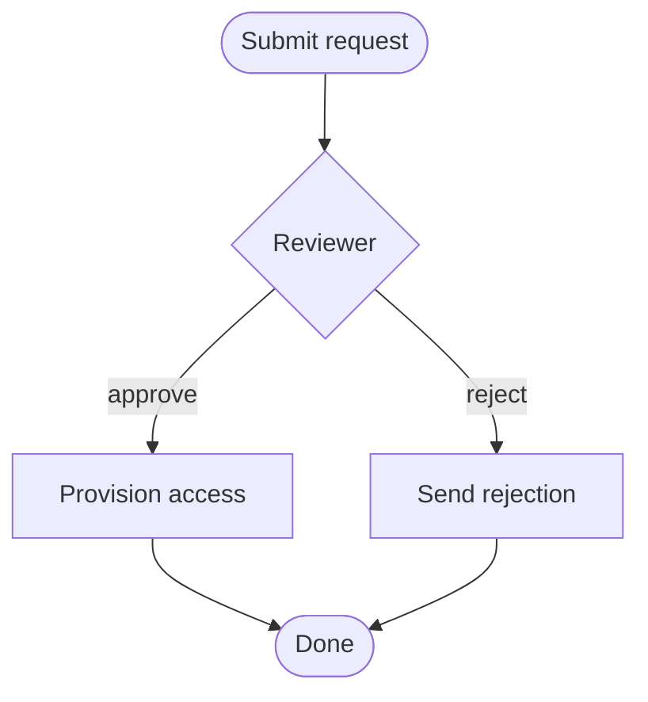
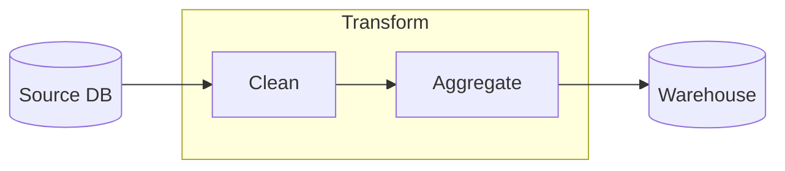

# Mermaid emission examples

Emit a mermaid flowchart inside the supported subset. figureflow upgrades it to an
interactive canvas. Stay within the grammar in `llms.txt`.

## Example 1 — an approval flow with an edge label

**Prompt:** "Flowchart: submit a request, a reviewer approves or rejects."

## Example 2 — a subgraph (becomes a group) with mixed shapes

**Prompt:** "Show an ETL job: extract from a DB, then a transform stage with two
steps, then load."

The `subgraph … end` block imports as a one-level **group**; `X` and `Y` become
its members and drag together on the canvas.
